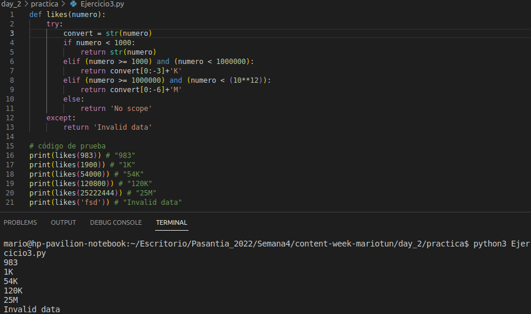

# **Ejercicios Practica**

- Escribir una función llamada contrasenaValida que reciba un string y retorne true si el string es igual a "2Fj(jjbFsuj" o "eoZiugBf&g9". De lo contrario debe retornar false.

    

- Escribir una función llamada calcularImpuestos que reciba dos argumentos numéricos: edad e ingresos. Si edad es igual o mayor a 18 y los ingresos son iguales o mayores a 1000 debe retornar ingresos * 40%. De lo contrario retornar 0.

    

- Escribe una función llamada likes que reciba un número y retorne un string utilizando el formato de K para miles y M para millones.

    Por ejemplo:

    1400 se convierte en 1K 34,567 se convierte en 34K 7’456,345 se convierte en 7M. Si el número es menor a 1000 se debe devolver el mismo número como un string.

    

- El índice de masa corporal (IMC), o BMI por sus siglas en inglés, es un valor que determina la cantidad de grasa de una persona.

    El BMI se calcula con la siguiente formula: peso / altura^2

    Escribir una función llamada bmi que reciba dos argumentos: peso y altura, y retorne un string con las siguientes posibilidades:

    "Bajo de peso" si el BMI < 18.5 "Normal" si está entre 18.5 y 24.9 "Sobrepeso" si está entre 25 y 29.9 "Obeso" si es igual o mayor a 30

    

# **Practica POO**
Con el siguiente enunciado:

Hacer un diagrama de clases para modelar un portafolio de obras de arte. Cada obra tiene un tipo (escultura, pintura, video,…), uno o más autores, una fecha de creación, un valor estimado. Adicionalmente cada obra tiene asociado un conjunto de fotografías y/o videos para exhibirla en el portafolio. A partir del portafolio se crean exposiciones de las obras en galerías. Cada exposición tiene unas fechas, un lugar y una descripción. Para una exposición se selecciona un conjunto de obras el portafolio que se van a presentar.

Entregar:

- El diagrama de clases.
- Codigo de la implementacion en el lenguaje de python.
- No es necesario persistir los datos.
- Capturas del funcionamiento del codigo.

## Diagrama de clases

## Creacion de objetos parte 1

## Creacion de objetos parte 2

## Resultado de le ejecucion

