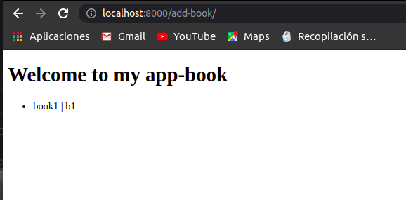
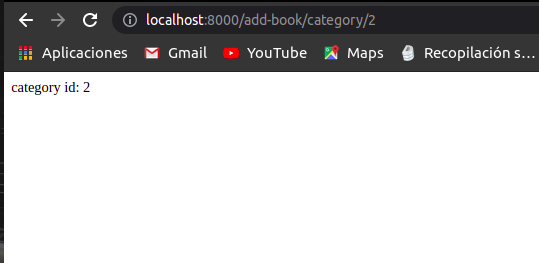
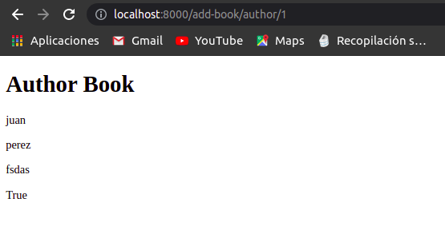

# Creacion y ejecucion de un proyecto basico en Django

## Crear una carpeta para el proyecto
1. Abra un comando o una ventana de terminal.
2. Cree un directorio llamado book-app y vaya a ese directorio.
    ~~~
    Windows
      md book-app
      cd book-app

    macOS or Linux
      mkdir book-app
      cd book-app
    ~~~
3. Use el comando siguiente para abrir la carpeta en Editor de codigo(en este caso Visual Studio Code).

    `code .`

## Crear y activar un entorno virtual
Abrir una nueva terminal dentro del deditor de codigo y verificar que la ruta se encuentre hasta la carpeta creada al inicio.
~~~
Windows
  python -m venv bookenv
  .\\bookenv\\Scripts\\Activate

macOS or Linux
  python3 -m venv bookenv
  source ./bookenv/bin/activate
~~~

## Instalar Django
1. Crear un archivo denominado requirements.txt dentro de la carpeta creada inicialmente(book-app).
2. Agregue el texto siguiente a requirements.txt.

    `Django`

3. Dentro de la ventana de terminal, ejecute el comando siguiente para instalar Django y cualquier otro paquete que figure en requirements.txt.

    `pip install -r requirements.txt`

## Creación de un proyecto con django-admin
Ejecute el comando siguiente dentro de la ventana del terminal en Visual Studio Code,para crar un proyecto llamado core. 
`django-admin startproject core .`

El punto final del comando es importante. Indica a django-admin que use la carpeta actual. Si deja fuera este punto final, se creará un subdirectorio adicional. 

## Ejecución del proyecto
Dentro de la ventana del terminal en Visual Studio Code, escriba el código siguiente para iniciar el servidor.

`python manage.py runserver`

## Ejemplo Ejecucion

**Lista de libros**

**Categorias**

**Autor**
